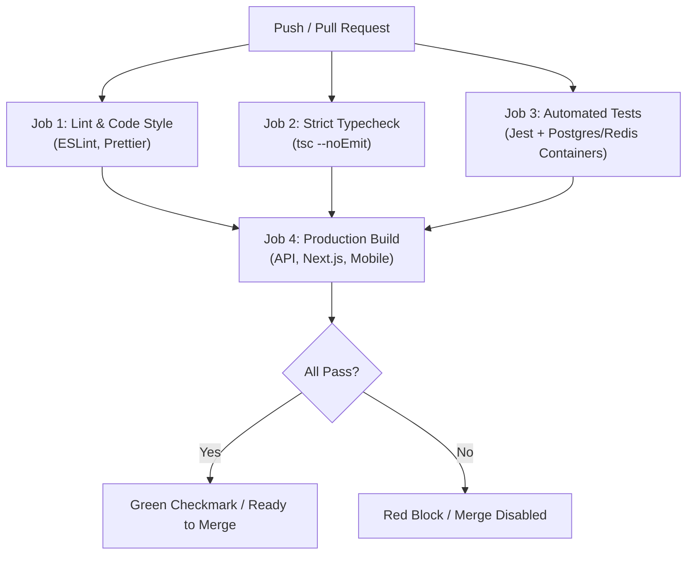

# Code Standards & CI/CD Pipeline — GalaPH

---

## 1. General Engineering Principles

- **Strict Typing**: Zero `any` in TypeScript. Zero untyped `dynamic` maps in Dart.
- **Fail Fast & Explicitly**: Validate all inputs at the boundary using schema parsers (Zod in TypeScript).
- **Separation of Concerns**: Controllers parse HTTP requests; Services execute business logic; Repositories/Prisma handle database queries.
- **No Console Clutter**: Use structured JSON logging (`pino` or `winston` in API). Never push raw `console.log` statements to production.
- **Exact Centavo Currency Math**: Represent all monetary figures as integer centavos or PostgreSQL `Decimal(10, 2)` to eliminate floating-point precision errors.

---

## 2. Backend Standards (Node.js + Fastify / Express + TypeScript)

### Layer Responsibilities

```
apps/api/src/
├── controllers/   # Validate input with Zod -> call service -> send HTTP status + JSON
├── services/      # Core logic (TollService, TransitService, SplitLedgerService, ConvoyService)
├── workers/       # BullMQ workers processing async OCR receipts and trip sync queues
├── middlewares/   # auth.middleware.ts, correlation.middleware.ts, validate.middleware.ts
├── routes/        # Express/Fastify routers mapping HTTP paths to controllers
├── sockets/       # WebSocket event handlers for real-time Convoy GPS telemetry
├── lib/           # prisma.ts (singleton client), redis.ts (ioredis connection pool)
├── utils/         # context.ts (AsyncLocalStorage), logger.ts (structured JSON logging)
└── errors/        # AppError custom hierarchy (NotFound, Unauthorized, Conflict)
```

### Rules

- **Route Validation**: Every mutation endpoint (`POST`, `PUT`, `PATCH`) must run a Zod validation middleware before reaching the controller.
- **Transactions**: Multi-table updates (e.g. creating an expense and generating granular consumer splits) must be wrapped in `prisma.$transaction()`.
- **Environment**: All environment variables are validated at boot in `src/config/env.ts` with Zod. The app exits immediately with code 1 if any required variable is missing.
- **Singletons & Shared Redis Namespacing**: `PrismaClient` and `ioredis` instances must be exported as singletons from `src/lib/` to avoid connection exhaustion. When connecting to an existing/shared Redis instance, all keys, locks, and BullMQ queues must strictly use the `galaph:` prefix.
- **Correlation Tracing**: All requests and structured logs must propagate `X-Correlation-ID` using `AsyncLocalStorage` without manual prop-drilling.

---

## 3. Web Frontend Standards (Next.js + TypeScript + Tailwind)

- **State Separation**:
  - Server state: TanStack Query (`@tanstack/react-query`) with explicit cache keys (`['trips', tripId]`, `['toll-estimate', routeId]`).
  - Real-time events: Centralized WebSocket listeners in custom hooks that mutate or invalidate the React Query cache.
  - Client UI state: React `useState` or Zustand for local modals, receipt item selectors, and drawer sheets.
- **Component Hygiene**:
  - Maximum 150 lines per component file. Extract sub-components (e.g., `<TollBreakdownCard>`, `<ItemizedReceiptRow>`).
  - No arbitrary styling. Respect tokens in `context/ui-context.md`.
  - Always implement the **4-state UI rule** (Loading Skeleton, Empty State, Error with Retry, Populated View).

---

## 4. Mobile Standards (Flutter / React Native)

- **Clean Architecture Pattern**:
  - `presentation/`: Widgets, screens, and state notifiers.
  - `domain/`: Pure models, value objects, and repository interfaces.
  - `data/`: Local SQLite database client, API HTTP service, and sync repositories.
- **Offline Reliability**:
  - All screens must load the local SQLite cache first before awaiting network responses.
  - Mutations (Add Expense, Check Off Item) update local state optimistically, save a sync action to SQLite, and dispatch to the API when network is available.

---

## 5. CI/CD Pipeline & Automated Quality Gates

Every pull request and push to `main` must pass the automated GitHub Actions pipeline.



## 6. Git & Commit Hygiene

- **Sync Upstream First**: Always run `git pull origin main` before starting work on a unit.
- **NEVER Commit to `main` / `master` Directly**:
  - Work on short-lived branches: `feat/unit-NN-description`, `fix/description`.
- **Merge Strategy**: Use **Squash and Merge** to maintain clean, linear history.
- **Commit Format**: Conventional Commits (`feat(api): ...`, `fix(web): ...`, `test(split): ...`).
