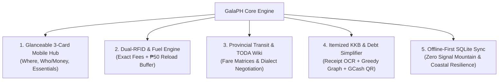
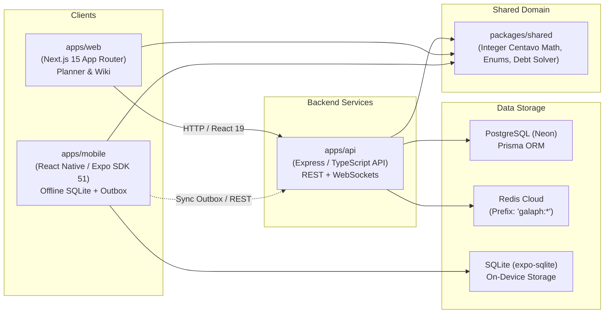
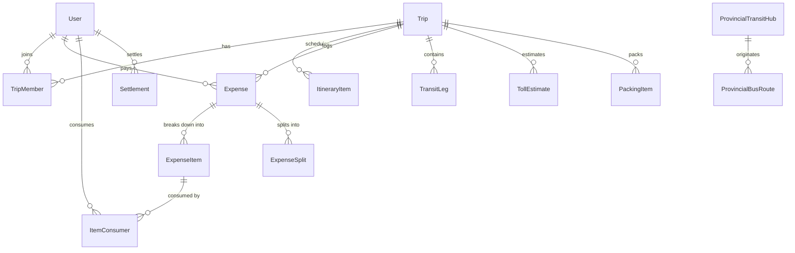

# GalaPH: Master Architecture & Functional Specification

> **An All-In-One Travel Operating System for Philippine Group Travel, Road Trips, and Mixed-Mode Convoys**

---

## 1. Problem & Solution Diagnosis

### 1.1. The Real-World Problem: The Philippine Group Travel Friction

Group travel in the Philippines (_barkada trips_ to destinations like La Union, Baler, Batangas, Baguio, Zambales) suffers from chronic structural and cultural frictions:

1. **The "Drawing" Problem (Indecision & Flake-Outs)**:
   - Trips stall in fragmented Messenger group chats because key facts are ambiguous: _Where are we going? When? How much will it cost? Who is actually committed?_
2. **The Dual-RFID Toll Nightmare**:
   - Philippine expressways are split between two non-interoperable RFID systems:
     - **Autosweep**: SLEX, Skyway 3, TPLEX, NAIAX, MCX.
     - **Easytrip**: NLEX, SCTEX, CAVITEX, CALAX, C5 Link.
   - Drivers frequently reach toll plazas with insufficient balances, holding up convoys and incurring penalties.
3. **The Commuter vs. Car Owner Divide**:
   - In most trips, some members drive in convoy while others ride provincial buses (PITX/Cubao) or local tricycles (TODA).
   - Commuters are often unfairly billed for car gas and highway tolls, or overcharged by provincial tricycle drivers without verified tariffs.
4. **The "Tragedy of the Commons" in Shared Gear**:
   - Without clear claiming, either three people bring a bulky cooler, or nobody brings the emergency first aid kit or butane stove.
5. **The Post-Trip "KKB / Singilan" Awkwardness**:
   - Splitting bills evenly creates deep resentment: non-drinkers are forced to subsidize expensive alcohol, and drivers who fronted fuel/toll must chase friends for weeks across messy spreadsheets.
6. **The "Jira-fication" Trap of Existing Apps**:
   - Enterprise-style travel tools overwhelm users with complex status pills, RACI charts, and multi-tab forms. In a barkada, 1 person plans and 7 people are passive; if the app is high-friction, everyone abandons it.

---

### 1.2. The Solution: Glanceable, High-Utility, Zero-Friction Travel OS

GalaPH eliminates these frictions with targeted domain logic and a radically simplified UX:



- **The 3-Second Rule**: Any user opening the app immediately sees where they are going, who is in, and their estimated share.
- **Automated Dual-RFID Load Allocation**: Pre-calculates exact entry-to-exit fees, grouped by provider, rounded to nearest ₱50 reload increments.
- **Itemized KKB Ledger**: Scans dining receipts, isolates alcohol costs away from non-drinkers, isolates tolls to car passengers, and uses a **Greedy Debt Graph Solver** to collapse $O(N^2)$ debts into minimal peer-to-peer GCash/Maya settlements.
- **1-Tap "Claim It" Gear Checklist**: Informal, single-touch responsibility claiming without corporate forms.

---

## 2. System Architecture & Boundaries

GalaPH is organized as an enterprise monorepo with 4 isolated tiers:



### 2.1. Architectural Invariants

1. **Integer Centavo Currency Invariant**: Floating-point numbers are strictly forbidden for currency math. All monetary calculations (tolls, fuel, receipt line items, splits, settlements) are executed in integer centavos (`₱100.50` = `10050`).
2. **Conservation of Money**: Across any expense split or debt graph simplification:
   $$\sum \text{Amount Paid} \equiv \sum \text{Amount Owed} \quad \text{and} \quad \sum_{i=1}^{N} \text{NetBalance}_i \equiv 0$$
3. **Dual-RFID Isolation**: Autosweep and Easytrip balances must never be co-mingled. Toll calculations must return isolated totals and separate top-up recommendations.
4. **Multi-Tenant Data Boundary**: Every query touching trips, expenses, itineraries, or packing items must be strictly partitioned by `tripId` with role-based member authorization.
5. **Offline-First Resilience**: All write mutations in mobile are executed optimistically against on-device SQLite, enqueued in `sync_outbox`, and flushed to the backend when connectivity resumes.

---

## 3. Technology Stack

| Tier                | Technology                                 | Purpose & Rationale                                                                                              |
| :------------------ | :----------------------------------------- | :--------------------------------------------------------------------------------------------------------------- |
| **Monorepo**        | npm workspaces                             | Zero-overhead monorepo management linking shared packages without build symlink breakage.                        |
| **Language**        | TypeScript 5.5+ (Strict)                   | End-to-end type safety, eliminating `any` and enforcing strict null checks (`noUncheckedIndexedAccess`).         |
| **Backend API**     | Node.js + Express + Zod                    | High-throughput REST API with Zod request validation and Pino structured logging with PII masking.               |
| **Database ORM**    | PostgreSQL + Prisma ORM                    | Relational schema with transactional atomicity (`prisma.$transaction`) and connection pooling (Neon).            |
| **Caching / Sync**  | Redis Cloud (`ioredis`)                    | Isolated key prefix (`galaph:*`) for rate limiting, session cache, and live GPS convoy coordinates.              |
| **Web Frontend**    | Next.js 15 (App Router) + React 19         | Responsive web app for trip planning, TODA crowdsourced wiki, and responsive KKB settlement.                     |
| **Web Styling**     | Tailwind CSS + Lucide Icons                | Philippine nature-inspired tokens (Sunset Terracotta, Sun Gold, Island Palm, Warm Slate).                        |
| **Mobile App**      | React Native 0.74.5 + Expo SDK 51          | Cross-platform iOS & Android mobile companion sharing domain math with web and API.                              |
| **Mobile Database** | `expo-sqlite` (WAL Mode)                   | High-performance local SQL database ensuring 100% offline access in remote provincial travel dead zones.         |
| **Mobile Hardware** | `expo-camera`, `expo-location`             | On-device receipt camera OCR scanning and driver convoy HUD telemetry.                                           |
| **Testing**         | Node.js Test Runner (`node --test`), `tsx` | Blazing-fast native testing across monorepo without Jest/Babel configuration drag (122+ passing tests).          |
| **CI/CD Quality**   | GitHub Actions                             | Quality gate enforcing Prettier check, strict typecheck across all 4 workspaces, linter, and ephemeral DB tests. |

---

## 4. Comprehensive Database Design

### 4.1. Server Database Schema (PostgreSQL via Prisma)



#### Core Relational Entities:

1. **`User` (`users`)**:
   - `id` (String, PK, cuid)
   - `email` (String, Unique)
   - `name` (String)
   - `passwordHash` (String, Nullable for guest/phone auth)
   - `phone` (String, Philippine mobile format)
   - `gcashNumber` / `mayaNumber` (String, For 1-tap settlement QR)
   - `avatarUrl` (String, Nullable)

2. **`Trip` (`trips`)**:
   - `id` (String, PK, cuid)
   - `title` (String, e.g. "Elyu Surf & Chill")
   - `destination` (String, e.g. "San Juan, La Union")
   - `startDate` / `endDate` (DateTime)
   - `travelMode` (Enum: `PRIVATE_CAR`, `MOTORCYCLE`, `COMMUTE_BUS`, `COMMUTE_VAN`, `HYBRID`)
   - `inviteCode` (String, Unique 6-char alphanumeric, e.g. `ELYU26`)
   - `createdById` (String, FK $\to$ `User.id`)

3. **`TripMember` (`trip_members`)**:
   - `id` (String, PK, cuid)
   - `tripId` (String, FK $\to$ `Trip.id`, Cascade)
   - `userId` (String, FK $\to$ `User.id`, Cascade)
   - `role` (Enum: `TRIP_LEAD`, `MEMBER`, `DRIVER`, `COMMUTER`)
   - `vehicleId` (String, Nullable, assigned vehicle tag)
   - `isDriver` (Boolean, Flag for toll/gas calculation)
   - `isNonDrinker` (Boolean, Flag for alcohol exclusion)
   - `dietaryNotes` (String, Nullable)
   - _Constraint_: `@@unique([tripId, userId])`

4. **`PackingItem` (`packing_items`)**:
   - `id` (String, PK, cuid)
   - `tripId` (String, FK $\to$ `Trip.id`)
   - `itemName` (String, e.g. "50L Ice Chest / Cooler")
   - `category` (String: `GEAR`, `FOOD_DRINKS`, `MEDICAL`, `COMFORT`, `DOCUMENTS`)
   - `quantity` (Int, Default: 1)
   - `assignedToId` (String, FK $\to$ `User.id`, Nullable $\implies$ Unclaimed)
   - `isPacked` (Boolean, Default: false)
   - `packedAt` (DateTime, Nullable)

5. **`Expense` (`expenses`)**:
   - `id` (String, PK, cuid)
   - `tripId` (String, FK $\to$ `Trip.id`)
   - `paidById` (String, FK $\to$ `User.id`)
   - `title` (String, e.g. "San Juan Surf Shack Dinner")
   - `category` (Enum: `FOOD_AND_DINING`, `ALCOHOL_AND_BAR`, `TOLL_HIGHWAY`, `FUEL_AND_GAS`, `COMMUTE_TICKET`, `LODGING_RESORT`, `MISCELLANEOUS`)
   - `totalAmount` (Decimal 10,2) & `totalCentavos` (Int)
   - `serviceAndTaxFee` (Decimal 10,2, SC & local government tax)
   - `receiptUrl` (String, Nullable receipt photo)
   - `vehicleIdOnly` (String, Nullable car filter)

6. **`ExpenseItem` (`expense_items`) & `ItemConsumer` (`item_consumers`)**:
   - Granular dish/line item extraction (`name`, `priceCentavos`, `quantity`).
   - M:N mapping of which specific friends ate/drank each item.

7. **`Settlement` (`settlements`)**:
   - `id` (String, PK, cuid)
   - `tripId` (String, FK $\to$ `Trip.id`)
   - `payerId` (String, FK $\to$ `User.id`)
   - `recipientId` (String, FK $\to$ `User.id`)
   - `amountCentavos` (Int)
   - `paymentMethod` (Enum: `GCASH`, `MAYA`, `CASH`, `BANK_TRANSFER`)
   - `settledAt` (DateTime)

8. **`ExpresswayTollRate` & `TollEstimate`**:
   - Complete Philippine expressway matrix (NLEX, SCTEX, TPLEX, Skyway 3, SLEX, CALAX, CAVITEX, MCX, CCLEX).
   - Plaza-to-plaza rate lookups across vehicle Class 1 (Sedan/SUV), Class 2 (Van/Bus), and Class 3 (Heavy Truck).

9. **`TodaTariff` (`toda_tariffs`)**:
   - Verified municipality tricycle matrices with `regularFarePerHead`, `specialTripFare`, `nightDiffFare`, `lastTripCurfew`, and `dialectTips`.

---

### 4.2. Mobile Local SQLite Schema (`expo-sqlite`)

For true offline provincial resilience, the mobile client mirrors the active trip locally:

- `local_trips`: Stores trip metadata, destination, dates, and cached status.
- `local_trip_members`: Cached roster with local role and dietary preferences.
- `local_itinerary_items`: Offline timeline stops.
- `local_expenses` & `local_expense_items`: Offline expense drafts.
- `local_packing_items`: Offline claimable checklist.
- `sync_outbox`: FIFO queue recording pending mutations (`ADD_EXPENSE`, `TOGGLE_PACKING`, `CLAIM_GEAR`, `TRIGGER_SOS`). When the network reconnects, mutations are posted sequentially and cleared upon HTTP 200/201.

---

## 5. System Functionalities & Domain Engines

### 5.1. Mobile Core Functions, Center Action Dock, & 3-Card Architecture

The mobile interface is architected around the most frequent high-stress group travel friction points, with crystal-clear trip management and a prominent, elevated Center Action Dock:

1. **Trip Lifecycle Management (Add, Edit, Switch)**:
   - **Create / Add a Trip**:
     - _Trigger_: `+ New Gala` button in the header bar or via the Center Action Sheet.
     - _Inputs_: Trip Title (e.g. _Baler Surf & Camp Weekend_), Destination (e.g. _Sabang Beach, Baler_), Start/End Dates, and Assembly Point (e.g. _Total NLEX Marilao • 3:30 AM_).
     - _Engine_: Saves atomically to local SQLite (`local_trips`), auto-generates a short alphanumeric invite code (e.g. `BALE24`), sets up the user as `TRIP_LEAD`, and switches active trip context.
   - **Edit Trip Details**:
     - _Trigger_: `[✏️ Edit Trip]` button directly on Card 1 (The Trip Card).
     - _Scope_: In-place editing of Title, Destination, Travel Dates, and Meetup / Assembly Point & Departure Time.
     - _Engine_: Updates `local_trips`, refreshes live overview cards, enqueues an `UPDATE_TRIP` outbox mutation, and displays an instant success toast.
   - **Switch Active Gala**:
     - _Trigger_: Tapping the active trip dropdown in the top header (`[📍 San Juan, La Union Gala ▼]`).
     - _Scope_: Opens the **Trip Switcher Modal** displaying all offline-cached trips with destination and member count. 1-tap switches the active trip and dynamically reloads itinerary, expenses, and gear.
   - **Barkada Onboarding**:
     - 1-tap **"Share to Group Chat"** button: instantly copies the pre-formatted invite link (`https://gala.ph/join/ELYU26`) with a clipboard toast for Messenger/Viber.
     - `+ Add Friend` modal: minimal 1-field name prompt for on-the-fly ambagan attribution.

2. **Highlighted Center Action Dock (Elevated FAB & Quick Action Sheet)**:
   - **Visual Hierarchy & Ergonomics**:
     - Centered between navigation tab pairs (`[Trip]` `[Itinerary]` **( (+) Center FAB )** `[Packing]` `[KKB Ledger]`).
     - 52dp elevated circular button floating above the tab bar with a radiant Sunset Terracotta (`#FF5A36`) glow, meeting high-contrast outdoor visibility standards.
   - **Quick Action Sheet Triggers**:
     - 🧾 **Split Expense / Scan Receipt (Primary Highlighted)**: Direct camera OCR scan or quick manual bill split with non-drinker exclusion.
     - 📍 **Add Itinerary Stop**: Fast-entry form for destination stop, time slot, and estimated cost.
     - 🎒 **Add Shared Packing Gear**: Add cooler, butane burner, beach tent, or speaker with 1-tap "I will bring this" toggle.
     - ✈️ **Start a New Gala**: Launches the Create Trip flow.

3. **Glanceable 3-Card Architecture**:
   - **Card 1: Trip Hero Card (Where & When)**: Destination, travel dates, assembly coordinates, invite code, and inline `[✏️ Edit Trip]` control.
   - **Card 2: Barkada & Quick Split Card (Who & Money)**: Horizontal avatar stack, glanceable per-head _Ambagan_ estimate (`₱1,750 / head`), total logged spend, and the primary high-contrast **"+ Split Expense / Scan Receipt"** CTA.
   - **Card 3: Shared Essentials Card (What to Bring)**: 1-tap **"Claim It"** checklist (`[✋ Tap to Claim]` assigns item to user; checkmark marks it packed).

---

### 5.2. Philippine Dual-RFID Toll & Fuel Engine

- **Symmetrical Plaza Resolution**: Resolves entry $\leftrightarrow$ exit segments regardless of forward/reverse direction.
- **Provider Account Separation**:
  - `Autosweep Total`: $\sum \text{Segment Fees} \to \text{Top-up buffer rounded to nearest } ₱50$.
  - `Easytrip Total`: $\sum \text{Segment Fees} \to \text{Top-up buffer rounded to nearest } ₱50$.
- **Fuel Estimator**: Calculates estimated fuel costs based on route distance and vehicle efficiency presets (`SEDAN_1_5L`, `SUV_DIESEL_2_8L`, `COMMUTER_VAN`, `MOTORCYCLE_150CC`).

---

### 5.3. Commuter Transit Router & TODA Tariff Wiki

- **Multi-Leg Provincial Journey Planner**: Chains Metro Manila bus terminals (PITX, Cubao, Buendia) with provincial stops and first-mile/last-mile TODA tricycles.
- **TODA Overcharge Protection**: Displays official local per-head vs. special trip rates.
- **Dialect Negotiation Tips**: Shows phonetic local phrases (e.g. Ilocano _"Mano po ti plete idiay San Juan?"_, Batangueño _"Diretso na ga sa pantalan?"_) and curfew warnings to avoid getting stranded.

---

### 5.4. Convoy Radar HUD & Emergency Roadside SOS

- **16-Point Cardinal Compass & Telemetry**: Live vehicle headings, relative front/back convoy order, and speed-tier classification.
- **Straggler Proximity Radar**: Flags when a vehicle drops $> 5.0\text{ km}$ behind the convoy lead.
- **1-Tap Roadside SOS Beacon**: Instantly transmits `EMERGENCY_STOP` with coordinates to all convoy cars and displays local hotline contacts (PNP, DPWH roadside assistance, towing).

---

### 5.5. Itemized KKB Ledger & Greedy Debt Simplifier

- **Camera Receipt OCR**: Extracts line items, quantities, service charges, and taxes.
- **Selective Consumption Tagging**: Tag specific eaters to each dish.
- **Non-Drinker Exemption Heuristic**: Detects alcohol items and automatically unchecks friends flagged with `isNonDrinker`.
- **Driver Carpool Isolation**: Toll and gas expenses are split exclusively among car occupants, exempting the driver.
- **Proportional SC & Tax Math**: Taxes and service charges are apportioned mathematically proportional to each person's food subtotal, distributing remainder odd centavos fairly.
- **Greedy Debt Graph Simplifier**:
  - Collapses tangled $N \times N$ bilateral debts into at most $N - 1$ direct transactions using a greedy bilateral balance reduction algorithm ($O(V \log V)$).
  - Generates pre-populated dynamic **GCash and Maya QR payment links** with exact centavos.

---

## 6. User Roles, System Capacities, and Permission Matrix

### 6.1. System Capacity & Group Sizing

- **Barkada Trip Capacity**: Designed for **2 to 20 members** per trip (the standard Philippine group travel sweet spot is 4 to 12 members, 1 to 3 cars).
- **Convoy Capacity**: Supports up to **5 vehicles** in active synchronized radar convoy.
- **Monorepo / Multi-Trip Scalability**: Unbounded multi-tenant trips, partitioned by indexed `tripId`.

---

### 6.2. Personas & Roles

```
[TRIP_LEAD] ──────> Creates trip, locks dates/destination, promotes roles
     │
     ├─── [DRIVER] ─────> Assigns vehicle, logs tolls/gas, broadcasts convoy telemetry
     ├─── [COMMUTER] ───> Plans bus/TODA legs, exempt from car tolls
     └─── [MEMBER] ─────> Claims shared gear, scans dining receipts, pays via GCash QR
            └── (Flag: Non-Drinker ──> Auto-exempt from alcohol bill line items)
```

1. **`TRIP_LEAD` (The Organizer / Bibo Friend)**:
   - Sets destination, dates, and meetup point.
   - Generates and shares invite codes/links.
   - Can edit or delete any itinerary item, expense, or member.
2. **`MEMBER` (General Participant)**:
   - Joins trip via 6-character code or deep link.
   - Claims shared packing gear with 1 tap.
   - Scans dining receipts or adds quick expenses.
   - Settles personal debts via GCash/Maya QR.
3. **`DRIVER` (Car Owner / Convoy Driver)**:
   - Tagged to a vehicle in the convoy (Lead or Sweep car).
   - Broadcasts live convoy telemetry and logs fuel/RFID tolls.
   - Can be flagged as exempt from gas/toll splits to compensate for vehicle wear-and-tear.
4. **`COMMUTER` (Bus / Commuter Friend)**:
   - Takes public transportation to reach the destination.
   - Accesses bus schedules and TODA negotiation guides.
   - Automatically isolated from expressway toll and vehicle fuel expenses.
5. **`isNonDrinker` (Dietary/Lifestyle Flag)**:
   - Attribute on `TripMember`.
   - The KKB OCR engine automatically excludes non-drinkers from any items categorized under `ALCOHOL_AND_BAR`.

---

### 6.3. Role & Action Permission Matrix (RBAC)

| System Action / Feature                       |    `TRIP_LEAD`     |      `MEMBER`      |      `DRIVER`      |     `COMMUTER`     |
| :-------------------------------------------- | :----------------: | :----------------: | :----------------: | :----------------: |
| **Create Trip & Set Destination/Dates**       |      ✅ Owner      |         ❌         |         ❌         |         ❌         |
| **Share Invite Link / Code to Chat**          |         ✅         |         ✅         |         ✅         |         ✅         |
| **Edit Trip Details & Assembly Point**        |         ✅         |         ❌         |         ❌         |         ❌         |
| **Add / Remove Members from Roster**          |      ✅ Full       |  ❌ (Self leave)   |         ❌         |         ❌         |
| **Change Member Roles (Driver/Commuter)**     |         ✅         |         ❌         |         ❌         |         ❌         |
| **Add / Edit Itinerary Stops**                |         ✅         |         ✅         |         ✅         |         ✅         |
| **Calculate Dual-RFID Toll & Top-Up Load**    |         ✅         |         ✅         |     ✅ Primary     |   ❌ (View only)   |
| **Broadcast Convoy Telemetry (Convoy HUD)**   |         ✅         |         ❌         |     ✅ Primary     |         ❌         |
| **Trigger Roadside Emergency SOS Beacon**     |         ✅         |         ✅         |     ✅ Primary     |         ❌         |
| **View Provincial Bus Routes & TODA Tariffs** |         ✅         |         ✅         |         ❌         |     ✅ Primary     |
| **Add Shared Packing Item (Claim It)**        |         ✅         |         ✅         |         ✅         |         ✅         |
| **Claim / Unclaim Shared Item**               |       ✅ Any       |      ✅ Self       |      ✅ Self       |      ✅ Self       |
| **Scan Receipt via Camera OCR**               |         ✅         |         ✅         |         ✅         |         ✅         |
| **Log Toll / Fuel Expense (Car-Only Split)**  |         ✅         |         ❌         |     ✅ Primary     |    ❌ (Exempt)     |
| **Exclude from Alcohol / Bar Expenses**       | ❌ (Unless tagged) | Tagged Non-Drinker | Tagged Non-Drinker | Tagged Non-Drinker |
| **Run Greedy Debt Simplification Solver**     |         ✅         |         ✅         |         ✅         |         ✅         |
| **Generate & Flash GCash/Maya QR Code**       |    ✅ Recipient    |    ✅ Recipient    |    ✅ Recipient    |    ✅ Recipient    |
| **Mark Settlement as Paid / Received**        |  ✅ Either party   |  ✅ Either party   |  ✅ Either party   |  ✅ Either party   |
| **Delete / Archive Trip**                     |      ✅ Owner      |         ❌         |         ❌         |         ❌         |

---

## 7. Verification & Implementation Blueprint

All capabilities described in this master specification are validated against the monorepo's automated quality gates:

1. **Static Typecheck Gate**: `npm run typecheck --workspaces` (0 errors across `@gala-ph/api`, `@gala-ph/mobile`, `@gala-ph/web`, `@gala-ph/shared`).
2. **Code Formatting Gate**: `npm run format:check` (100% Prettier compliance).
3. **Linting Quality Gate**: `npm run lint` (0 ESLint warnings or errors).
4. **Automated Test Suite**: `npm test` (All 122+ unit and integration tests passing).
5. **Metro Bundler Export**: `npx expo export --no-bytecode` (Clean Android and iOS bundle export).
