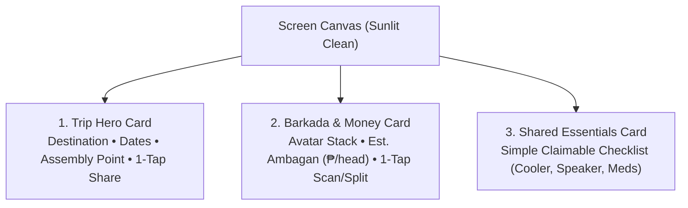

# Trip Coordination & UX Architecture — GalaPH

## Problem Analysis, Core Objective, and Radically Simplified Solution

---

## 1. Problem Research: Why Group Travel Apps Fail (The "Too Much" Trap)

### A. The Ground Reality of Philippine Road Trips

Philippine _barkada_ road trips (to destinations like La Union, Baler, Batangas, Baguio, Zambales) are informal, spontaneous, and high-energy. They are **not** corporate team-building retreats or agile software sprints.

In every barkada trip, there is a universal group dynamic:

- **1 "Bibo" Organizer**: The one friend who coordinates the dates, books the Airbnb/villa, and estimates expenses.
- **5 to 9 Passive Friends**: They love going, but they are lazy coordinators. They will **not** read a manual, configure multi-tab modals, check off corporate-style lifecycle gates, or learn a complex app.

### B. The Failure Mode: The "Jira-fication" of Travel

When travel apps over-engineer features, they introduce cognitive overload:

1. **Too Many Lifecycle Steps**: Displaying a 4-step or 5-phase "Roadmap Stepper" with sub-checklists, status pills (`COMPLETED`, `ACTIVE`, `UPCOMING`), and multiple dynamic buttons turns a vacation app into project management software. Users feel like they are doing administrative work.
2. **Too Many Form Fields & Toggles**: Asking an organizer to fill out forms with member names, driver toggles, non-drinker toggles, vehicle dropdowns, and role permissions kills momentum.
3. **The "RACI Assignment" Fallacy**: Forcing users to assign single-owner responsibilities through nested dropdowns or avatar chips fails because group packing is informal: someone says _"Ako na sa cooler"_ in the group chat, and that's it.
4. **Screen Real Estate Cannibalization**: When complex progress steppers and configuration cards take up 60% of the screen, the only things users actually care about (Where are we going? Who's going? How much is my share?) are buried below the fold.

---

## 2. Core Objective

> **Transform GalaPH from an over-engineered "management system" into an effortless, glanceable trip companion that anyone can understand in 3 seconds without a tutorial.**

### Design Principles:

1. **The 3-Second Rule (Glanceable Triad)**: When a user opens the app, they must immediately see:
   - **Where & When** (Destination, dates, assembly time).
   - **Money at a Glance** (Estimated budget per person or total KKB).
   - **What's Happening Next** (Next stop or critical gear).
2. **Zero-Configuration Onboarding**: No complex member setup. 1 tap copies an invite link to the Messenger group chat.
3. **"Claim It" Simplicity**: Replace complex assignment matrices with a simple 1-tap checklist where friends tap to claim an item.
4. **Radical Decluttering**: Strip away lifecycle status pills, redundant phase breadcrumbs, and multi-tab modals.

---

## 3. The Solution: The "3-Card" Architecture (Simpler, Cleaner, Better)

Instead of a sprawling dashboard with roadmap steppers and bureaucratic rosters, the main screen is reduced to **three clean, high-impact cards**:

---

### Card 1: The Trip Card (Where & When)

- **Destination & Duration**: E.g. _"La Union • Oct 15–18 (4D3N)"_
- **Assembly Info**: Single clear line: `📍 Shell Magallanes • 4:00 AM Meetup`
- **1-Tap Share**: A single, clean button: `Share to Group Chat`.
  - Directly copies: _"Uy tara Elyu! Join our GalaPH trip: https://gala.ph/join/ELYU26"_
  - **No modal, no tabs, no manual forms.**

---

### Card 2: Barkada & Quick Split (Who & Money)

- **Who's In**: A clean, horizontal avatar stack (e.g. `[JD] [MS] [CD] [BA] + Add Friend`).
  - Tapping `+ Add Friend` is a simple 1-line text input: enter friend's name, done.
- **Budget at a Glance**:
  - `₱1,750 / head est.` (Calculated automatically from logged stops & tolls).
- **Primary Action**: Prominent button: **"+ Split Expense / Scan Receipt"**.
  - Takes you straight to the camera OCR or quick expense logger.

---

### Card 3: Shared Essentials (What to Bring — "Claim It" Flow)

Instead of a rigid enterprise inventory system, group packing becomes an informal, claimable checklist:

- `[x] 50L Ice Chest / Cooler — Marco`
- `[ ] Portable Gas Stove — [Tap to Claim]`
- `[x] Bluetooth Speaker — Bea`
- `[ ] First Aid & Meds — [Tap to Claim]`

**How it works**:

- Tap an unclaimed item $\rightarrow$ your name is instantly attached.
- Tap the checkbox $\rightarrow$ marked packed.
- That's it. No categories, no RACI charts, no multi-level configuration.

---

## 4. Feature Comparison: Over-Engineered vs. Radically Simplified

| Feature Area       | The "Doing Too Much" Approach (Rejected)                                                                    | The Simplified Solution (Approved)                                                         |
| :----------------- | :---------------------------------------------------------------------------------------------------------- | :----------------------------------------------------------------------------------------- |
| **Trip Progress**  | 4-step roadmap stepper with status pills (`ACTIVE`, `UPCOMING`), checklists, and step numbers taking 350px. | **Removed**. Replaced with a single assembly badge (`📍 Shell Magallanes • 4:00 AM`).      |
| **Member Invites** | Multi-tab modal (Share tab vs Manual tab), driver toggles, non-drinker toggles, vehicle selectors.          | **1-Tap Share Button**. Copies pre-formatted Messenger invite link to clipboard.           |
| **Barkada Roster** | Massive cards listing every member with role tags, vehicle tags, gear tags, and driver tags.                | **Horizontal Avatar Stack** with member count + 1-tap quick add.                           |
| **Shared Gear**    | Categorized database (GEAR, FOOD, COMFORT) with assignee dropdowns and unassigned warning badges.           | **Claimable Checklist**. Tap an item to claim it (`[Tap to Claim]`), tap checkbox to pack. |
| **Screen Height**  | 1,700+ lines of nested layout requiring 5 scrolls to see anything.                                          | **Fits on a single mobile screen without scrolling**. Zero clutter.                        |

---

## 5. Summary of Implementation Changes

1. **Purge the Roadmap Stepper**: Remove the heavy 4-step lifecycle stepper from `TripOverviewScreen.tsx`.
2. **Flatten the Invite Flow**: Remove the multi-tab invite modal in favor of an instant clipboard share button and a 1-line name adder.
3. **Streamline Barkada Display**: Replace the giant member card list with a sleek avatar stack and clear ambagan metrics.
4. **Streamline Packing**: Adopt the 1-tap "Claim It" pattern in both `TripOverviewScreen.tsx` and `PackingScreen.tsx`.
